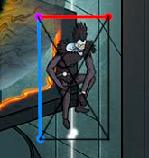
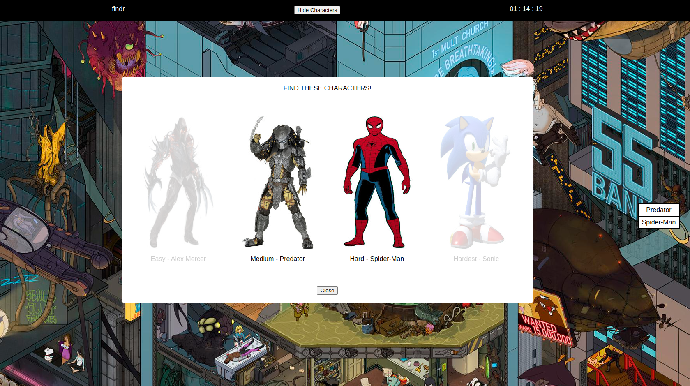

<h1>Where's Waldo - The Odin Project</h1>

This is a Where's Waldo like searching game built with React and Firebase. There are four characters hidden within the image, and the user find them by clicking on the character and selecting the appropriate one.

Firebase is used to store the coordinates of each character. When you select a character on the UI the selected character's coordinates data is read from Firebase and is either validated or invalidated. This decision is made when the area where you clicked the mouse falls within the coordinates read from Firebase for the specific character.

## How It Works

<ol>
  <li>Click anywhere on the web page to bring up an interactive list of the characters you are searching for.
    <ul>
      <li>The coordinates of where you clicked on the web page are stored within a state.</li>
    </ul>
  </li>
  <li>When you select a character from the interactive list, the coordinates of your mouse click are checked against the coordinates of the character stored on Firebase.
    <ul>      
      
      <li>The starting/ending X and Y coordinates are calculated to define the location of a character on the web page.</li>
      <li>If the coordinates of your mouse clicked are determined to be within this clickable area for your selected character that is a success.</li>
    </ul>
  </li> 
</ol>

Give it a try here: https://keffri.github.io/wheres-waldo/

  

## Author

👤 **Keffri Neal**

- Twitter: [@keffri](https://twitter.com/keffri)
- Github: [@keffri](https://github.com/keffri)
